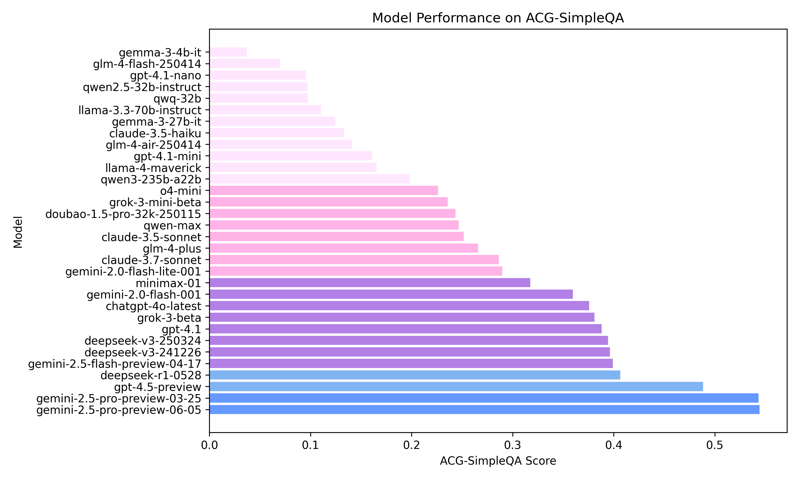

# ACG-SimpleQA

<p align="center">
   🌐 <a href="https://prnake.github.io/ACG-SimpleQA/" target="_blank">Website</a> • 
   🤗 <a href="https://huggingface.co/datasets/Papersnake/ACG-SimpleQA" target="_blank">Hugging Face</a>
   <br>  
   <a href="README.md">中文</a> | <a href="README_en.md">English</a>
</p>

**ACG-SimpleQA** is an objective knowledge question-answering dataset focused on the Chinese ACG (Animation, Comic, Game) domain, containing **4242** ~~auto-generated~~ carefully designed QA samples. This benchmark aims to evaluate large language models' factual capabilities in the ACG culture domain, featuring Chinese language, diversity, high quality, static answers, and easy evaluation.

## 📢 Latest Updates

- **\[2025.04.24\]** We officially release the ACG-SimpleQA dataset! Welcome to download it from 🤗[Hugging Face](https://huggingface.co/datasets/Papersnake/ACG-SimpleQA)

## 💫 Introduction

ACG-SimpleQA is a comprehensive benchmark designed to test large language models' factual knowledge in the ACG culture domain. The dataset features:

* 🀄 **Chinese**: ACG-SimpleQA focuses on Chinese ACG knowledge, providing a thorough evaluation of LLMs' factual abilities in this area.
* 🍀 **Diversity**: Covers multiple subdomains such as anime, games, manga, and music, ensuring comprehensive assessment.
* ⚡ **High Quality**: Strict quality control ensures the accuracy of questions and answers.
* 💡 **Static**: All reference answers are time-invariant, and the knowledge cutoff is before 2024, ensuring long-term validity.
* 🗂️ **Easy Evaluation**: The evaluation method is consistent with [SimpleQA](https://github.com/openai/simple-evals) and [ChineseSimpleQA](https://github.com/OpenStellarTeam/ChineseSimpleQA).

## 🔍 Motivation

Although large language models (LLMs) have made significant progress in general knowledge and reasoning, they still show clear shortcomings in long-tail domains such as ACG (Animation, Comic, Game) regarding knowledge mastery and factual QA ability. Our main motivations for building ACG-SimpleQA are:

- **Limitations of existing research**: Benchmarks like [ChineseSimpleQA](https://github.com/OpenStellarTeam/ChineseSimpleQA) and SimpleQA focus on non-long-tail knowledge, resulting in low model differentiation. Only a few works, such as [RoleEval](https://github.com/Magnetic2014/RoleEval), target the ACG domain.
- **Unquantified real-world model differences**: In practice, we observe that models like DeepSeek outperform Qwen, GLM, etc., in ACG-related areas (e.g., anime, games). However, there is no dedicated, public leaderboard to quantify and compare mainstream models' performance in ACG, making it hard for model trainers to optimize for this domain.
- **Lack of benchmarks leads to data imbalance**: Without authoritative ACG evaluation, model trainers focus on benchmarks like MMLU, C-Eval, GSM8K, AIME, Codeforces, leading to over-sampling of these domains and neglecting long-tail knowledge. This results in models excelling in mainstream areas but performing poorly in ACG and other long-tail domains, especially among some domestic vendors.
- **Promoting diversity and long-tail capability**: By launching benchmarks like ACG-SimpleQA, we hope to encourage model trainers to increase ACG domain data diversity, optimize training token allocation, and improve models' long-tail knowledge and role-playing abilities, promoting broader application.

<!-- **The goals of ACG-SimpleQA are:** -->

<!-- - Fill the gap in Chinese ACG benchmarks;
- Quantify mainstream models' factual ability in ACG knowledge;
- Guide model trainers to improve long-tail knowledge coverage and performance;
- Promote LLMs' progress in diverse, long-tail scenarios. -->

## 🌟 Data Sources

* **Main Source**: About 99% of samples come from [Moegirlpedia](https://zh.moegirl.org.cn), a highly authoritative and rich source of ACG background information.
* **Supplementary Sources**: For niche works or special settings, other authoritative sites are referenced to ensure completeness and accuracy.

## 📊 Data Distribution

Category distribution in the dataset:

| Category | Samples |
|----------|---------|
| Anime    | 1927    |
| Game     | 1817    |
| Manga    | 240     |
| Music    | 63      |
| Other    | 195     |
| **Total**| **4242**|

## 📋 Data Format

ACG-SimpleQA is stored in JSONL format, one JSON object per line, with the following fields:

```python
{
  "question": "...", // Question text
  "answer": "...", // Standard answer
  "category": "...", // Category (e.g., Anime, Game, Manga, Music, Other)
  "urls": ["..."] // Source links
}
```

## 🎯 Design Principles

ACG-SimpleQA follows the design principles of SimpleQA, ensuring high standards of uniqueness, objectivity, temporal stability, challenge, and verifiability for each question.

### Uniqueness & Clarity

* Each question has a single, unambiguous answer.
* Questions must clearly specify the work, chapter, or plot range, eliminating ambiguity. For example, questions should specify the work's name, specific plot, or time point, avoiding vague expressions.

### Objectivity

* Only verifiable objective facts are involved; answers must come from original text, official settings, or authoritative sources.
* No subjective evaluations, open-ended discussions, or leading phrases (e.g., "in your opinion").
* Questions should focus on information that can be checked, ensuring respondents rely on knowledge, not speculation.

### Temporal Stability

* Answers must be long-term valid, avoiding changes due to work updates or plot developments.
* Avoid phrases like "as of year X" or "latest season." If a time point is needed, specify the plot, episode, or character state to ensure the answer doesn't change over time.

### Challenge & Knowledge Depth

* Questions should be challenging, requiring in-depth knowledge of the work's details and settings, not just simple facts.
* Questions should test detailed elements such as character backgrounds, event sequences, or setting differences, not just surface-level knowledge.

### Verifiability

* Answers must be clearly supported by original text or authoritative resources.
* Questions should be designed so that answers can be confirmed through standard verification channels (e.g., Moegirlpedia), avoiding unverifiable guesses.

## 📊 Leaderboard

<p align="center">
  
</p>

| Model                          | ACG-SimpleQA |
|--------------------------------|--------------|
| gemini-2.5-pro-preview-03-25   | 0.5434       |
| gpt-4.5-preview                | 0.4884       |
| gemini-2.5-flash-preview-04-17 | 0.3993       |
| deepseek-v3-241226             | 0.3963       |
| deepseek-v3-250324             | 0.3944       |
| gpt-4.1                        | 0.3880       |
| grok-3-beta                    | 0.3810       |
| chatgpt-4o-latest              | 0.3758       |
| gemini-2.0-flash-001           | 0.3597       |
| minimax-01                     | 0.3175       |
| gemini-2.0-flash-lite-001      | 0.2897       |
| claude-3.7-sonnet              | 0.2864       |
| glm-4-plus                     | 0.2659       |
| claude-3.5-sonnet              | 0.2515       |
| qwen-max                       | 0.2466       |
| doubao-1.5-pro-32k-250115      | 0.2435       |
| grok-3-mini-beta               | 0.2357       |
| o4-mini                        | 0.2263       |
| llama-4-maverick               | 0.1655       |
| gpt-4.1-mini                   | 0.1610       |
| glm-4-air-250414               | 0.1412       |
| claude-3.5-haiku               | 0.1334       |
| gemma-3-27b-it                 | 0.1247       |
| llama-3.3-70b-instruct         | 0.1106       |
| qwq-32b                        | 0.0974       |
| qwen2.5-32b-instruct           | 0.0969       |
| gpt-4.1-nano                   | 0.0957       |
| glm-4-flash-250414             | 0.0700       |
| gemma-3-4b-it                  | 0.0370       |

<!-- ## 🛠️ Evaluation Method -->

## ❓ FAQ

**Q: What is the sample generation process?**  
A: First, about 150,000 entries are crawled from Moegirlpedia, filtered by content length (>800 chars). Five QA pairs are auto-generated per entry (~500,000 total), then one QA per entry is kept. Difficulty scoring and filtering remove unsuitable QAs (~40,000 left). Initial model evaluation (e.g., gemma-4b, gpt-4o) removes questions easily answered by all models, with some manual selection. Further filtering by length (question <55 chars, answer <7 chars, all-Chinese answers, no duplicate answers, ~5,000 left), then non-ACG or unsuitable samples are removed (~4,000 left), followed by manual adjustment and review for compliance. The full pipeline will be open-sourced in the future.

**Q: Why do some questions look odd or problematic?**  
A: The question style follows SimpleQA, and some may be niche or detail-oriented, which fits the evaluation goal. A few outliers will be continuously annotated and fixed, but do not affect overall conclusions.

**Q: Is the sampling range only for popular works?**  
A: Sampling is balanced; popular anime and games have more entries, but many long-tail works and settings are also included for diversity.

**Q: Can a model just memorize Moegirlpedia to do well?**  
A: No. In SimpleQA, 80% of data comes from Wikipedia, which all major models have seen, but performance is still limited. Models need to be large enough and see multiple versions of related concepts to excel. Pretraining requires extensive and diverse sampling; rote memorization is not enough.

**Q: How do evaluation results relate to model size and training strategy?**  
A: SimpleQA-style leaderboard scores correlate with model size, but smart token allocation and data diversity can yield above-average results. For example, the relatively small `gemini-2.5-flash-preview` performs well on ACG-SimpleQA. This shows that dedicated ACG benchmarks help guide pretraining data selection and improve long-tail capabilities.

## 📜 Citation

If you use this repository in your research, please consider citing:

```bibtex
@misc{pka2025acgsimpleqa,
    title={ACG-SimpleQA},
    author={Papersnake},
    howpublished = {\url{https://github.com/prnake/ACG-SimpleQA}},
    year={2025}
}
```

## 🤝 Contribution

Community contributions are welcome! If you find any issues or have suggestions, please submit an issue or pull request.

## 📄 License

This project is licensed under the MIT License. See the LICENSE file for details.